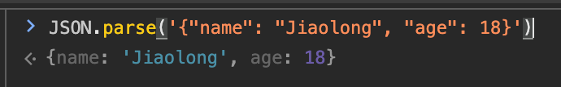
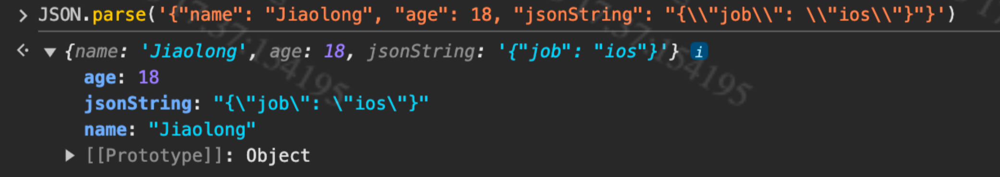

在船票提醒需求中，需要通过jsb向h5透传一个服务端下发的jsonString，由于js对string的转义规则和平台的不一致，如果以string的形式传值会导致前端解析数据失败。

## 前端JSON解析

JS有两种方式解析json，object和string。
下面来对比下不同类型需要给出的格式

|                | object                                                       | string                                                       |                                                              |
| -------------- | ------------------------------------------------------------ | ------------------------------------------------------------ | ------------------------------------------------------------ |
| json解析       |  |  | 在解析正常结构的json时所需要的结构相同                       |
| 带转义字符     |  |  | 在这种情况，obj不需要为特殊字符做转义处理，但双引号依然需要单反斜杠做转义。而string形式则需要为特殊字符做转义，其中双引号需要双反斜杠才能正确转义，不然会解析失败。 |
| 嵌套json       |  |  | 对于基础的字典嵌套 并无差别                                  |
| 嵌套jsonString |  |  | 在这个case里可以看到 两种格式的处理是不一样的                |

由上，前端期望传入的待解析格式知道了，接下来看看由各平台转义后的string是什么样。
## Dic → String

在需求中遇到的核心问题是在端上做的obj2json得到的结果和js想要的预期格式不匹配（双引号处没有使用双反斜杠），导致解析失败，那就来看看不同平台下的转义区别。

|                            | result（以下为字符串格式，省略了前后引号）                   |
| -------------------------- | ------------------------------------------------------------ |
| origin                     | {"name": "Jiaolong", "jsonString": "{\"job\": \"ios\"}"}     |
| iOS（NSJSONSerialization） | {\"jsonString\":\"\\\"job\\\":\\\"ios\\\"\",\"name\":\"Jiaolong\"} |
| web（JSON.stringify）      | {"name":"Jiaolong","jsonString":"{\\"job\\": \\"ios\\"}"}    |
| 在线工具                   | {\"name\":\"Jiaolong\",\"jsonString\":\"{\\\"job\\\": \\\"ios\\\"}\"} |

可以看到使用在线工具和端上的转义结果一致（顺序的区别）对反斜杠和双引号分别加了一个反斜杠进行转义，但是使用JSON.stringify只加了一个反斜杠来转义。

至此需求中遇到问题的根本原因找到了，因为JS的解析转义规则和其他平台的都不一致，导致由其他平台生成的jsonString会解析失败，只有使用前端的JSON.stringify才能得到满足JSON.parse预期的string。这也是为什么web端没有类似问题出现。

最后的解决方案也很简单，使用object的形式传值。

## TODO

挖坑：问什么解析规则不一致呢，有空看看JSON.stringify/parse的源码

