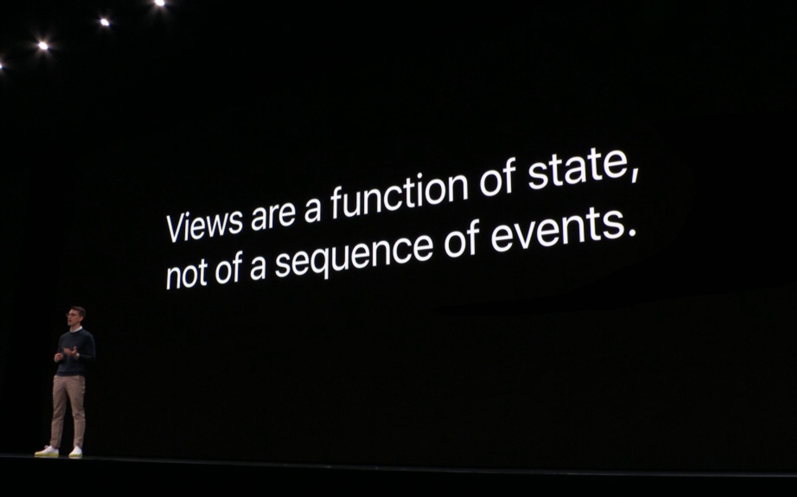
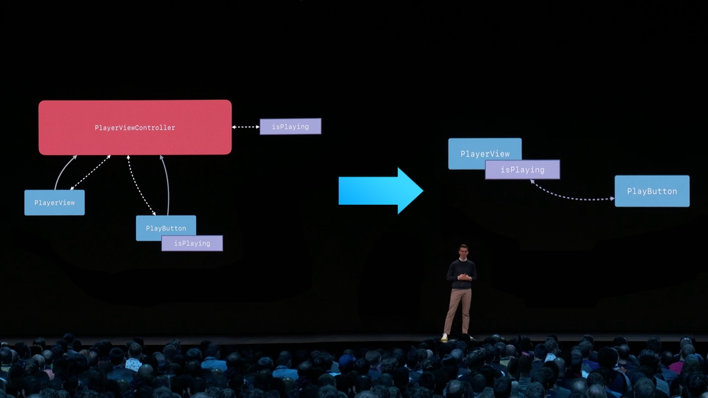
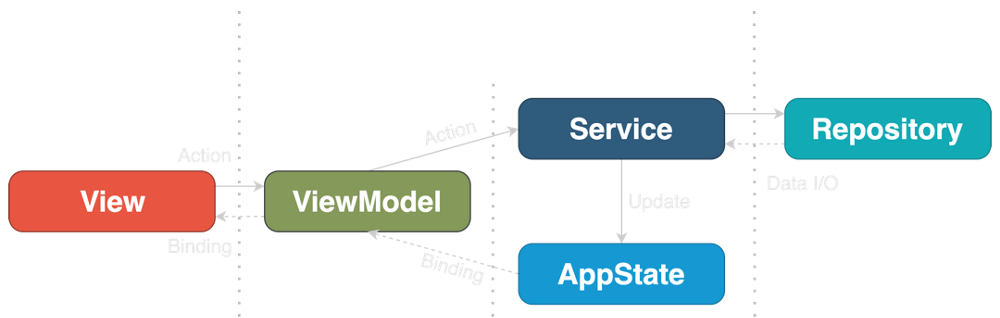
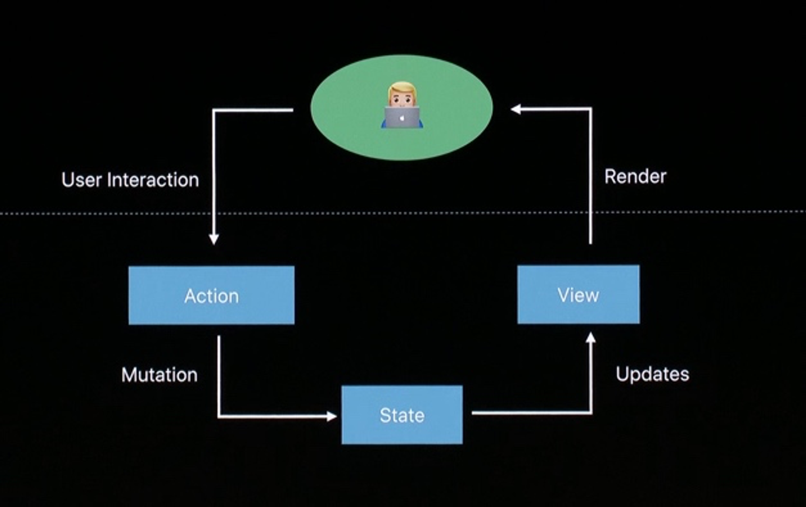
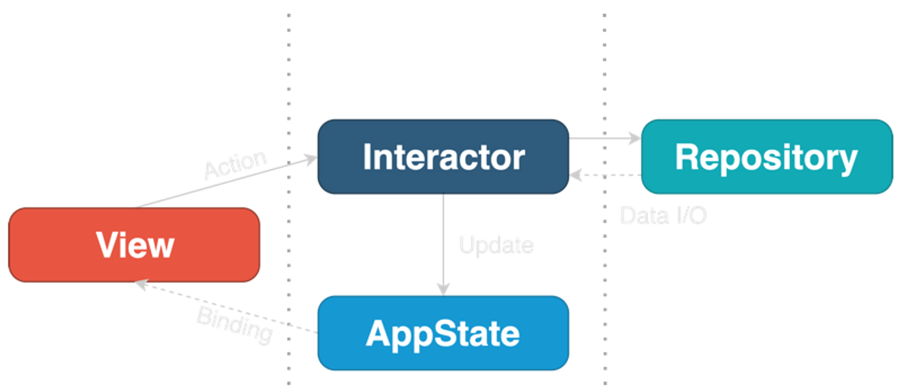

# {{ $frontmatter.title }} <Badge type="tip" :text="String($frontmatter.date).slice(0,10)" />


> 翻译自：**[Clean Architecture for SwiftUI](https://nalexn.github.io/clean-architecture-swiftui/?utm_source=nalexn_github)**

------

你能够想象UIKit已经出现了11年了么，自从2008年发布了iOS SDK后我们一直在用它构建app。在这段时间里，开发者不断的寻找最合适的架构来构建他们的app，最开始是MVC，再之后我们见证了MVP、MVVM、VIPER、RIBs和VIP。

但最近发生了一些很重要的事情，以至于这些大多数的iOS架构都将成为历史。

没错我谈论的就是SwiftUI，不管你喜欢与否，它都是iOS开发的未来，当我们面对设计架构的挑战时，它是游戏规则的改变者。

## 概念上发生了什么改变？

UIKit是一个命令式的、事件驱动的框架。我们可以引用层次结构中的每个视图，改变它的外观当视图被加载或作为事件的反应(点击button或一个新的数据变得可展示在UITableView中)。我们使用回调，委托，目标-动作来处理这些事件。

现在，一切都消失了。SwiftUI是一个声明式的、状态驱动的框架。我们不能引用层次结构中的任何视图，也不能直接改变视图作为对事件的反应。相反，我们改变和视图绑定的状态。委托、目标-操作、响应链、KVO——所有的回调技术都被闭包和绑定所取代。

SwiftUI中的每个视图都是一个结构体（struct），它的创建速度比类似的UIView后代快很多倍。该结构体保留了对它提供给函数体以呈现UI的状态的引用。该结构体保持对状态的引用，提供了一个body的函数来引用UI。



所以一个视图在SwiftUI里只是一段函数，你提供给他输入状态，他绘制输出。改变输出的唯一方法是改变输入：我们不能通过添加或删除子视图来改变算法(body)——所有可能对显示UI的更改都必须在body中声明，不能在运行时更改。

对于SwiftUI而言，我们没有添加或删除子视图，而是在预定义的流程中启用或禁用UI的不同部分。

## **MVVM是新的架构标准**

SwiftUI内建了MVVM。

在最简单的情况下，视图不依赖于任何外部状态，它的本地@State变量充当ViewModel的角色，提供订阅机制(绑定)，以便在状态发生变化时刷新UI。

对于更复杂的场景，视图可以引用外部ObservableObject，在这种情况下可以是一个不同的ViewModel。

不管怎样，SwiftUI处理视图状态的方式与经典的MVVM非常相似(除非我们引入更复杂的编程实体图)。



> *And well, you don’t need a ViewController anymore.*

让我们来考虑用一个简单的MVVM模块在SwiftUI app里进行快速示例。

**Model**: 数据容器

```swift
struct Country {
    let name: String
}
```

**View**: SwiftUI视图

```swift
struct CountriesList: View {

    @ObservedObject var viewModel: ViewModel

    var body: some View {
        List(viewModel.countries) { country in
            Text(country.name)
        }
        .onAppear {
            self.viewModel.loadCountries()
        }
    }
}
```

**ViewModel**: ObservableObject，它封装了业务逻辑，并允许View观察状态的变化

```swift
extension CountriesList {
    class ViewModel: ObservableObject {
        @Published private(set) var countries: [Country] = []

        private let service: WebService

        func loadCountries() {
            service.getCountries { [weak self] result in
                self?.countries = result.value ?? []
            }
        }
    }
}
```

在这个简化的例子中，当View出现在屏幕上时，onAppear回调调用ViewModel上的loadCountries()，触发网络调用来加载WebService内部的数据。ViewModel在回调中接收数据，并通过@Published变量推送更新，由视图观察更新。



虽然这篇文章是专门针对Clean Architecture的，但我收到了很多关于MVVM在SwiftUI中的应用的问题，所以我把原来的样例项目移植到MVVM的一个单独的分支中。你可以比较两者，选择最适合你需要的。该项目的主要特点:

- Vanilla SwiftUI + Combine 实现
- 解耦的表示层、业务逻辑和数据访问层
- 完整的测试覆盖，包括UI（感谢 [ViewInspector](https://github.com/nalexn/ViewInspector)）
- 类似redux的集中式AppState作为事实的单一来源
- 程序化的navigation（支持deep links）
- 基于泛型的简单而灵活的网络层
- 处理系统事件（当应用处于非活动状态时模糊视图层次结构）

## 在底层，SwiftUI是基于ELM的

只需要看下「MCE 2017: Yasuhiro Inami, Elm Architecture in Swift」这个演讲的28:26部分

[MCE 2017: Yasuhiro Inami, Elm Architecture in Swift](https://youtu.be/U805TqsDIV8)

这家伙2017年就有了SwiftUI的工作原型

是不是感觉我们在真人秀节目中，单亲孩子的SwiftUI刚刚知道他的父亲是谁?

无论如何，我们感兴趣的是，我们是否可以使用任何其他ELM概念来使我们的SwiftUI应用程序更好。

我按照ELM语言网站上的ELM体系结构描述去做，但是没有发现任何新的东西。SwiftUI基于与ELM相同的本质；

> Model：应用程序的状态 View：一种将状态转换为HTML的方法 Update：一种基于消息更新状态的方法

我们在什么地方见过这个，不是吗?



我们已经有了Model，View从Model自动生成，我们唯一能调整的是Update交付的方式。我们可以采用REDUX的方式，使用Command模式来改变状态，而不是让SwiftUI的视图和其他模块直接写入状态。虽然我更喜欢在我以前的UIKit项目(swift❤)中使用REDUX，但对于SwiftUI应用程序是否需要它是值得怀疑的——数据流已经在控制之下，很容易追踪。

## **Coordinator 就是 SwiftUI**

协调器（又名路由器）是VIPER、肋骨和MVVM-R架构的重要组成部分。在UIKit应用中，为屏幕导航分配一个单独的模块是合理的——从一个ViewController到另一个ViewController的直接路由导致了它们的紧密耦合，更不用说在ViewController的层次结构中深度链接到屏幕的编码地狱了。

在UIKit中添加一个协调器是很容易的，因为UIView（和UIViewController）是环境独立的实例，你可以在任何时候通过从层次结构中添加/删除来翻转。

当涉及到SwiftUI时，这样的动态性在设计上是不可能的：层次结构是静态的，所有可能的导航都是在编译时定义和固定的。在运行时没有办法对层次结构进行调整：相反，导航完全由通过绑定改变的状态控制：比如你的NavigationView, TabView或.sheet()，每次你都会看到一个init，它接受Binding参数进行路由。

"视图是状态的函数"还记得吗？这里的关键词是功能。一种将状态数据转换为渲染图像的算法。

这就解释了为什么从SwiftUI视图中提取路由是一个相当大的挑战：路由是这个绘图算法的一个组成部分。

Coordinators旨在解决两个问题：

1. 将视图控制器彼此解耦
2. 程序化的导航

SwiftUI有一个内置的机制，可以通过前面提到的绑定进行程序化导航。我有一篇[专门的文章](https://nalexn.github.io/swiftui-deep-linking/)讲述。

至于SwiftUI中视图的解耦，这是很容易实现的。如果您不希望视图A直接引用视图B，您可以简单地将B转换为A的泛型参数，然后就此结束。

你也可以使用相同的方法来抽象视图A可以打开B的实际方式(使用TabView, NavigationView等)，尽管我不认为在你的视图中实际说明这个问题。如果需要，您可以轻松地在适当的位置更改路由模型，而无需触及视图B。

不要忘记@ViewBuilder和AnyView——另外两种使B类型隐式地用于A的方法。

鉴于上述情况，我相信SwiftUI使协调器变得不必要：我们可以使用通用参数或@ViewBuilder 隔离视图，并使用标准工具实现程序化导航。

quickbirdstudios有一个在SwiftUI中使用协调器的实际例子，然而，在我看来，这有点过头了。此外，这种方法有几个缺点，比如授予coordinator对所有viewmodel的完全访问权，但是您应该检查一下并自己决定。

## **VIPER, RIBs and VIP 是否适合于 SwiftUI?**

我们可以从这些架构中借鉴很多很棒的想法和概念，但最终，这两种架构的规范实现对SwiftUI应用来说都没有意义。

首先，正如我刚才所阐述的，现在没有更多的实际需要有一个协调员。

其次，SwiftUI中数据流的全新设计，加上对视图状态绑定的原生支持，减少了所需的设置代码，以至于呈现器变成了一个愚蠢的实体，什么都不做。

随着模式中模块数量的减少，我们发现我们也不需要Builder了。所以基本上，整个模式就崩溃了，因为它旨在解决的问题不再存在了。

SwiftUI在系统设计中引入了自己的一套挑战，所以我们必须从头开始重新设计UIKit的模式。

有人试图坚持使用心爱的架构，但请不要这样做。

## **Clean Architecture**

让我们参考一下Uncle Bob’s Clean Architecture, VIP的前身。

> 通过将软件分成几层，并遵循依赖规则，您将创建一个本质上是可测试的系统，并具有所有隐含的好处。

Clean Architecture对于我们应该引入的层的数量是相当自由的，因为这取决于应用领域。

但在最常见的手机应用场景中，我们需要设置三个层次:

- 表示层
- 业务逻辑层
- 数据访问层

因此，如果我们通过SwiftUI的特性来提炼干净架构的需求，我们会得到这样的东西:



我创建了一个[demo](https://github.com/nalexn/clean-architecture-swiftui)来说明此模式的使用。该应用程序与其他国家对话。eu REST API来显示国家列表及其详细信息。

### **AppState**

AppState是模式中唯一需要定义为对象的实体，特别是一个ObservableObject。或者，它可以是一个结构体，包装在Combine中的currentvaluessubject中。

就像Redux一样，AppState作为事实的单一来源，并保持整个应用程序的状态，包括用户数据，身份验证令牌，屏幕导航状态(选定的选项卡，呈现的表格)和系统状态(是活动的/是后台的，等等)。

AppState不知道任何其他层，也不包含任何业务逻辑。

项目中的例子

```swift
class AppState: ObservableObject, Equatable {
    @Published var userData = UserData()
    @Published var routing = ViewRouting()
    @Published var system = System()
}
```

### **View**

这是常用的SwiftUI视图。它可以是无状态的，也可以有本地的@State变量。

没有其他层知道视图层的存在，因此没有必要将其隐藏在协议后面。

当视图被实例化时，它通过SwiftUI的标准依赖注入来接收AppState和Interactor，该变量的属性为@Environment、@EnvironmentObject或@ObservedObject。

副作用由用户的操作(比如点击按钮)或视图生命周期事件onAppear触发，并被转发给交互器。

```swift
struct CountriesList: View {

    @EnvironmentObject var appState: AppState
    @Environment(\\.interactors) var interactors: InteractorsContainer

    var body: some View {
        ...
        .onAppear {
            self.interactors.countriesInteractor.loadCountries()
        }
    }
}
```

### **Interactor**

**Interactor**封装了特定视图或一组视图的业务逻辑。与AppState一起构成了业务逻辑层，它完全独立于表示和外部资源。

它是完全无状态的，并且只引用作为构造函数参数注入的AppState对象。

交互器应该使用协议“facade”，以便视图可以在测试中与模拟的交互器通信。

```swift
protocol CountriesInteractor {
    func loadCountries()
    func load(countryDetails: Binding<Loadable<Country.Details>>, country: Country)
}

// MARK: - Implemetation

struct RealCountriesInteractor: CountriesInteractor {

    let webRepository: CountriesWebRepository
    let appState: AppState

    init(webRepository: CountriesWebRepository, appState: AppState) {
        self.webRepository = webRepository
        self.appState = appState
    }

    func loadCountries() {
        appState.userData.countries = .isLoading(last: appState.userData.countries.value)
        weak var weakAppState = appState
        _ = webRepository.loadCountries()
            .sinkToLoadable { weakAppState?.userData.countries = $0 }
    }

    func load(countryDetails: Binding<Loadable<Country.Details>>, country: Country) {
        countryDetails.wrappedValue = .isLoading(last: countryDetails.wrappedValue.value)
        _ = webRepository.loadCountryDetails(country: country)
            .sinkToLoadable { countryDetails.wrappedValue = $0 }
    }
}
```

### **Repository**

存储库是一个用于读写数据的抽象网关。提供对单个数据服务的访问，无论是web服务器还是本地数据库。

我有一篇[专门的文章](https://nalexn.github.io/separation-of-concerns/)解释为什么提取Repository是必要的。

例如，如果应用程序使用其后端，谷歌地图API并向本地数据库写入内容，则将有三个存储库:两个用于不同的web API提供商，一个用于数据库IO操作。

存储库也是无状态的，没有对AppState的写访问，只包含与处理数据相关的逻辑。它对视图或交互器一无所知。

真实的存储库应该隐藏在协议后面，以便交互者可以在测试中与模拟的存储库对话。

```swift
protocol CountriesWebRepository: WebRepository {
    func loadCountries() -> AnyPublisher<[Country], Error>
    func loadCountryDetails(country: Country) -> AnyPublisher<Country.Details.Intermediate, Error>
}

// MARK: - Implemetation

struct RealCountriesWebRepository: CountriesWebRepository {

    let session: URLSession
    let baseURL: String
    let bgQueue = DispatchQueue(label: "bg_parse_queue")

    init(session: URLSession, baseURL: String) {
        self.session = session
        self.baseURL = baseURL
    }

    func loadCountries() -> AnyPublisher<[Country], Error> {
        return call(endpoint: API.allCountries)
    }

    func loadCountryDetails(country: Country) -> AnyPublisher<Country.Details, Error> {
        return call(endpoint: API.countryDetails(country))
    }
}

// MARK: - API

extension RealCountriesWebRepository {
    enum API: APICall {
        case allCountries
        case countryDetails(Country)

        var path: String { ... }
        var httpMethod: String { ... }
        var headers: [String: String]? { ... }
    }
}
```

由于WebRepository将URLSession作为构造函数参数，因此通过使用自定义URLProtocol模拟网络调用来测试它非常容易

## 思考

这个演示项目现在有97%的测试覆盖率，这都要归功于Clean Architecture的“依赖规则”和应用程序在多个层上的分离。

它提供了完整的CoreData持久层设置，推送通知的深度链接，以及其他重要但实用的示例。