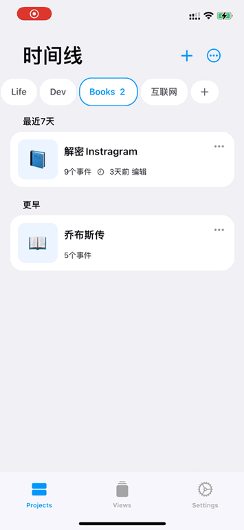
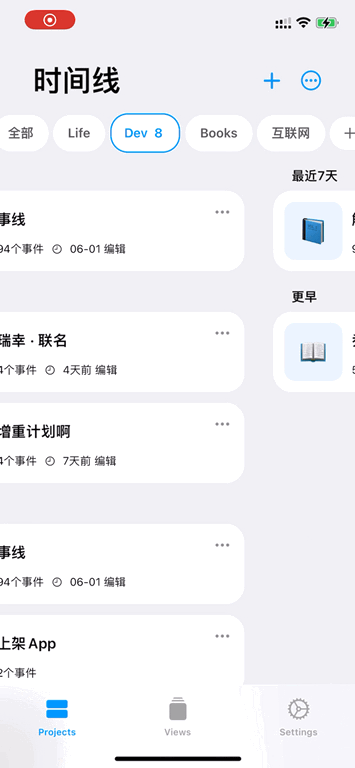

# {{ $frontmatter.title }} <Badge type="tip" :text="String($frontmatter.date).slice(0,10)" />

::: tip
在使用SwiftUI的TabView时发现一个问题，当左右切换页面时如果数据比较多（也可能是超出了一屏）就会导致切换的一瞬间卡顿，解决方案：使用UIKit代替。
:::

先看替换后的效果，录屏中可能不太明显，但是使用中还是感知很大的

| 优化前                                       | 优化后                                       |
| -------------------------------------------- | -------------------------------------------- |
|  |  |


## UIPageViewController

在SwiftUI中内嵌UIKit是一个很常见的操作，TabView在UIKit是通过UIPageViewController实现的，找了下相关的实现发现正好有官方给的例子：

[Interfacing with UIKit | Apple Developer Documentation](https://developer.apple.com/tutorials/swiftui/interfacing-with-uikit)

关键代码：

::: details

```swift
func pageViewController(
            _ pageViewController: UIPageViewController,
            viewControllerBefore viewController: UIViewController) -> UIViewController? {
                guard let index = controllers.firstIndex(of: viewController) else {
                    return nil
                }
                if index > 0 {
                    return controllers[index - 1]
                }
                return nil
            }
        
        func pageViewController(
            _ pageViewController: UIPageViewController,
            viewControllerAfter viewController: UIViewController) -> UIViewController? {
                guard let index = controllers.firstIndex(of: viewController) else {
                    return nil
                }
                if index < (controllers.count ) - 1 {
                    return controllers[index + 1]
                }
                return nil
                
            }
```

:::


### 循环页面

其中例子中会循环页面，如果不想要循环的话修改下Coordinator中的before和after的实现即可：

```swift
func pageViewController(
            _ pageViewController: UIPageViewController,
            viewControllerBefore viewController: UIViewController) -> UIViewController? {
                guard let index = controllers.firstIndex(of: viewController) else {
                    return nil
                }
                if index > 0 {
                    return controllers[index - 1]
                }
                return nil
            }
        
        func pageViewController(
            _ pageViewController: UIPageViewController,
            viewControllerAfter viewController: UIViewController) -> UIViewController? {
                guard let index = controllers.firstIndex(of: viewController) else {
                    return nil
                }
                if index < (controllers.count ) - 1 {
                    return controllers[index + 1]
                }
                return nil
                
            }
```

### Bug

本来以为很顺利的时候发现左右切换时会把navigationBar的位置刷新出来，而我的页面是不需要的，就导致了异常的行为


经过一番查询，在stackoverflow里找到了类似的问题。总结一下原因，虽然在外层已经设置过了`.navigationBarHidden(true)`但是在构建PageViewController时会把View以`UIHostingController`  的形式加载，而`UIHostingController`本身会再次调用`setNavigationBarHidden`  即导致了状态栏的出现。在尝试了几个解决方案后终于找到一个有效的：

为UIHostingController新建一个子类，并且让它无权访问UINavigationController

```swift
final public class RestrictedUIHostingController<Content>: UIHostingController<Content> where Content: View {

    /// The hosting controller may in some cases want to make the navigation bar be not hidden.
    /// Restrict the access to the outside world, by setting the navigation controller to nil when internally accessed.
    public override var navigationController: UINavigationController? {
        nil
    }
}
```

评论中有在讲UIKit和SwiftUI可能使用了同一个导航栏实例，而这样做也会导致SwiftUI的导航栏失效，但由于我的app中并没有用到内置导航栏所以暂时没有这个困扰，之后如果有问题可以再探究下。

## 完整代码

::: details

```swift
struct PageViewController: UIViewControllerRepresentable {
    var pages: [UIViewController]
    @Binding var currentPage: Int
    
    func makeCoordinator() -> Coordinator {
        Coordinator(self)
    }
    
    func makeUIViewController(context: Context) -> UIPageViewController {
        let pageViewController = UIPageViewController(
            transitionStyle: .scroll,
            navigationOrientation: .horizontal)
        pageViewController.dataSource = context.coordinator
        pageViewController.delegate = context.coordinator
        pageViewController.view.backgroundColor = .clear
        
        return pageViewController
    }
    
    func updateUIViewController(_ pageViewController: UIPageViewController, context: Context) {
        pageViewController.setViewControllers(
            [context.coordinator.controllers[currentPage]], direction: .forward, animated: true)
        
    }
    
    
    class Coordinator: NSObject, UIPageViewControllerDataSource, UIPageViewControllerDelegate {
        var parent: PageViewController
        var controllers = [UIViewController]()
        
        init(_ pageViewController: PageViewController) {
            parent = pageViewController
            controllers = parent.pages
        }
        
        func pageViewController(
            _ pageViewController: UIPageViewController,
            viewControllerBefore viewController: UIViewController) -> UIViewController? {
                guard let index = controllers.firstIndex(of: viewController) else {
                    return nil
                }
                if index > 0 {
                    return controllers[index - 1]
                }
                return nil
            }
        
        func pageViewController(
            _ pageViewController: UIPageViewController,
            viewControllerAfter viewController: UIViewController) -> UIViewController? {
                guard let index = controllers.firstIndex(of: viewController) else {
                    return nil
                }
                if index < (controllers.count ) - 1 {
                    return controllers[index + 1]
                }
                return nil
                
            }
        
        func pageViewController(
            _ pageViewController: UIPageViewController,
            didFinishAnimating finished: Bool,
            previousViewControllers: [UIViewController],
            transitionCompleted completed: Bool) {
                if completed,
                   let visibleViewController = pageViewController.viewControllers?.first,
                   let index = controllers.firstIndex(of: visibleViewController) {
                    visibleViewController.navigationController?.setNavigationBarHidden(true, animated: false)
                    parent.currentPage = index
                }
            }
    }
}

final public class RestrictedUIHostingController<Content>: UIHostingController<Content> where Content: View {
    
    /// The hosting controller may in some cases want to make the navigation bar be not hidden.
    /// Restrict the access to the outside world, by setting the navigation controller to nil when internally accessed.
    public override var navigationController: UINavigationController? {
        nil
    }
    
}

//use
struct HomeProiectView: View {
    var body: some View {
        VStack{
            PageViewController(pages: views, currentPage: $currentGroup)
                .onAppear{
                    
                    print(views.count)
                }
        }
        .edgesIgnoringSafeArea(.all)
        
        
    }
    
    var views: [UIViewController] {
        return [RestrictedUIHostingController(rootView:Text("0")),
                RestrictedUIHostingController(rootView:Text("1")),
                RestrictedUIHostingController(rootView:Text("2"))
        ]
    }
    
}
```

:::


参考链接：

1. https://developer.apple.com/tutorials/swiftui/interfacing-with-uikit
2. https://stackoverflow.com/questions/69883830/uipageviewcontroller-swipe-ignores-swiftuis-navigationbarhiddentrue
3. https://stackoverflow.com/questions/58704688/unable-to-hide-the-navigationbar-when-embedding-swiftui-in-uikit/71131226#71131226